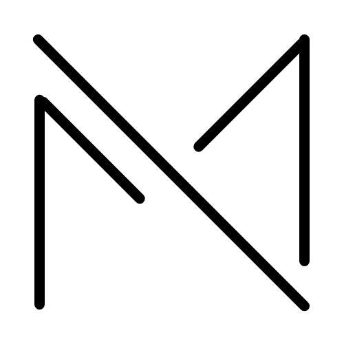
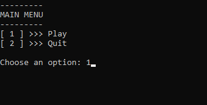
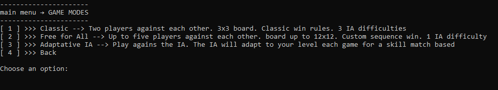
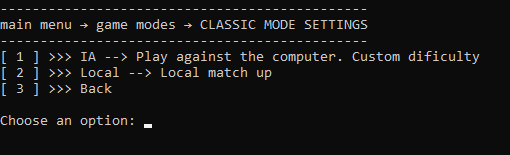
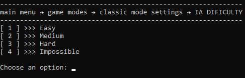
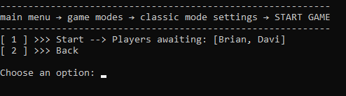

	
	<h3 align="center">Matriks</h3>
	
The engine upgrade of the old tic-tac-toe

## Table Of Contents
- [Table Of Contents](#table-of-contents)
- [About The Project](#about-the-project)
- [Overal view](#overal-view)
- [Screenshots](#screenshots)
- [Code Explained](#code-explained)
  - [engine/](#engine)
    - [board.py](#boardpy)
    - [player.py](#playerpy)
      - [def minimax](#def-minimax)
      - [class IPlayer](#class-iplayer)
    - [win\_check.py](#win_checkpy)
  - [abstracts.py](#abstractspy)
  - [game\_modes.py](#game_modespy)
  - [helpers.py](#helperspy)
    - [class Matrix](#class-matrix)
  - [main.py](#mainpy)
  - [menus.py](#menuspy)
  - [settings.py](#settingspy)

## About The Project
> [YouTube video](https://youtu.be/XREOomG4Nsk)

> [GitHub repository](https://github.com/Davi-S/tic_tac_toe.py-2.0)

> [Author GitHub](https://github.com/Davi-S)

This project is about **Matrices relations** and **Artificial Intelligence** integrated with the tic-tac-toe game to create an uncommon **game engine**.
There are many great tic-tac-toe games out there, however, I didn't find one that suit my expectations of the game potential, so I created this enhanced one.
With Matriks, the possibilities for variations of the classical game are unlimited.

Here are some key potentials of Matriks:

* Can be easily incorporated with a UI.
* No 3x3 board limitations. Tic-tac-toe can now be played even on irregular boards.
* More players. With Matriks, the 2 player limit is gone! More players, more fun.
* AI to make everything more interesting.

## Overal view
As said earlier, this project is not a game itself, it is an **engine** for creating variations of the classical tic-tac-toe. That's why I have not implemented a fancy **GUI** (graphical user interface). Instead, I made a simple text-based **TUI** (terminal user interface) just for some presentation of the project.

The code was written using the [Google Python Style Guide Rules](https://google.github.io/styleguide/pyguide.html).

## Screenshots

## Code Explained
### engine/
The main part of the project is the content inside the **engine/** folder. It is composed of a **board**, a **player**, and a **win checker**.
Here is where all the important logic happens

#### board.py
The board file contains the **class Board**.
The **class Board**  has a **two-dimensional list** as an attribute that stores the game state and some other methods to modify it

#### player.py
This file is responsible for managing all player-related stuff; like inputs and decisions about where to place a mark.

##### def minimax
This minimax function has a **depth** and **alfa-beta-pruning** implementation.

The **alfa-beta-pruning** makes the code faster, as it ignores branches that do not have a better evaluation than those already analyzed.

The **depth** is used in two ways; as a **difficulty level** and as a **breakpoint**.
As a difficulty level because more depth leads to more game branches and more optimal options to play (and vice-versa). And as a breakpoint, because using greater boards can lead to a great delay, so, the depth prevents long wait times.

##### class IPlayer
Most player classes use the **def minimax** with different depths to choose a place on the board, except for the **class HumanPlayer** and **class EasyPlayer**.

The **class HumanPlayer** collects input from the user (terminal).
And the **class EasyPlayer** just plays randomly. Normally does not win, but is fast

#### win_check.py
The win_check file contains the **class WinChecker**.
The **class WinChecker** receives a board state and calculates if there is a win in this state.

I preferred to implement it as a class and not as a function because this way it's possible to pass a board on the **class WinChecker** instance creation instead of passing the board in every call of the WinChecker (if it was a function).

### abstracts.py
Just hold some abstract classes. I used a separate file for this to be more organized.

### game_modes.py
This file uses the **engine/** content to make some fun games.

Each game can be implemented in its way. For example:
The **Simple** game mode uses a loop and changes players each round.
A **Teams** game mode can swap teams and players of each team every round.
In a **Mass** game mode, all players can play at the same time.
And so on. The possibilities are almost infinite.

An important observation is that those currently implemented game modes start the game on instance creation (by calling the **def run** method on the **def __init__** method).
This is because of the **class Menu** implementation (see the [**menus.py**](#menus.py) for more information). **It is not necessary if another GUI is used.**

### helpers.py
This file contains generic and helpful functions that can be used in many places of the code.
The functions here are usually simple.

An important thing here is the **class Matrix**.

#### class Matrix
This class can be a little confusing. It uses the relations between the X and Y axis to find groups (a row, column, or diagonal) in the given matrix.

font: https://stackoverflow.com/a/43311126/14593213

The groups can be used to verify wins.

### main.py
This is the file meant to be run.
It uses the **menus.py** (see the [**menus.py**](#menus.py) for more information) to create the TUI and join everything together.

### menus.py
This is a very important file, as it dictates how many other things are going to work. Even though it interferes with the **engine/** content.

It creates a user-friendly interface with options to choose from. Every option has a callable attached to it. When the user chooses an option, the callable is called.

To make nested menus it's necessary to put a **Menu.run()** as a callable option.
This is what happens on the **main.py** file. Menus are called inside functions (for more organization of the menus) **recursively**.
This is also why the game mode classes start the game on instance creation. The class must be created and called on the option callable.

Menus like these are not these good for bigger projects, but for a small presentation of the **Matriks**, they are acceptable.

### settings.py
A simple file to put some global constants for slight changes in the TUI behavior.
It is currently used to store sleep times.
